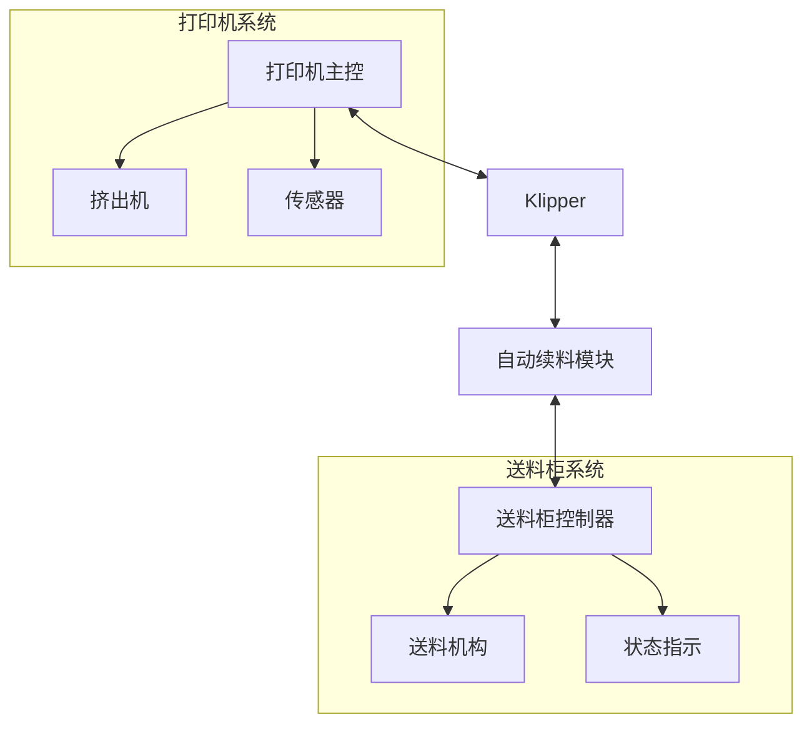
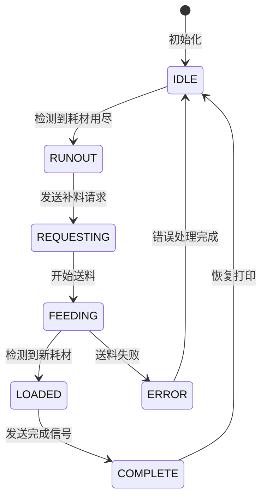

### 1. 系统功能概述

**核心功能：**
1. 耗材用尽检测
2. CAN通信控制
3. 状态管理
4. 错误处理
5. 用户交互

### 2. 系统架构



### 3. 状态流程



### 4. 通信协议

#### A. CAN消息ID
```
基础节点ID: 从4开始递增
通信ID:
- 发送ID = 节点ID * 2 + 256
- 接收ID = 节点ID * 2 + 256 + 1
```

#### B. 消息格式

1. 发送消息格式（打印机 -> 送料柜）
```
Byte 0: 命令类型
        0x01 = 请求补料
        0x02 = 停止补料
        0x03 = 状态查询
        0x04 = 打印中
        0x05 = 打印完成
        0x06 = 打印暂停
        0x07 = 打印取消
        0x08 = 打印机空闲
Byte 1: 挤出头编号 (0=第一个挤出头, 1=第二个挤出头)
Byte 2-7: 预留
```

2. 接收消息格式（送料柜 -> 打印机）
```
Byte 0: 状态码
        0x00 = 空闲
        0x01 = 准备送料
        0x02 = 送料中
        0x03 = 送料完成
        0x04 = 送料失败
Byte 1: 进度 (0-100)
Byte 2: 错误码
        0x00 = 无错误
        0x01 = 机械故障
        0x02 = 耗材缺失
        0x03 = 其他错误
Byte 3-7: 预留
```

### 5. 工作流程

#### A. 自动续料流程
1. 检测到耗材用尽
2. 暂停打印，保存打印状态
3. 发送补料请求到送料柜
4. 等待送料柜响应并开始送料
5. 监测新耗材插入
6. 发送完成信号
7. 恢复打印

#### B. 错误处理流程
1. 发生错误（机械/通信/其他）
2. 记录错误信息
3. 通知用户
4. 等待用户处理
5. 返回空闲状态

### 6. 配置项

```ini
[feeder_cabinet]
# CAN通信配置
canbus_uuid: F01000000601
can_interface: can1
```

### 7. 用户交互命令

1. G-code命令：
```
START_FEEDER_CABINET      ; 手动启动续料
QUERY_FEEDER_CABINET      ; 查询当前状态
CANCEL_FEEDER_CABINET     ; 取消续料操作
```

2. 状态查询返回信息：
```
当前状态：[状态描述]
进度：[0-100]%
错误信息：[如果有]
```

### 8. 错误处理机制

#### A. 通信错误
- CAN总线通信失败
- 消息发送失败
- 状态同步错误

#### B. 机械错误
- 送料机构故障
- 传感器异常
- 堵料检测

#### C. 错误响应
1. 记录错误日志
2. 通知用户
3. 停止当前操作
4. 等待用户干预

### 9. 安全机制

1. 状态检查
- 打印机状态验证
- 送料柜状态验证
- 传感器状态验证

2. 操作保护
- 防止重复操作
- 状态合法性验证
- 操作超时保护

3. 系统保护
- 打印任务保护
- 机械保护
- 异常状态恢复

### 10. 日志记录

1. 操作日志
- 开始/结束时间
- 操作类型
- 操作结果

2. 错误日志
- 错误类型
- 错误时间
- 错误详情
- 系统状态

### 11. 使用流程

1. 正常流程
```
检测到耗材用尽 -> 暂停打印 -> 发送补料请求 -> 
等待送料 -> 检测到新耗材 -> 恢复打印
```

2. 错误流程
```
检测到错误 -> 停止操作 -> 记录错误 -> 
通知用户 -> 等待处理 -> 恢复空闲状态
```
